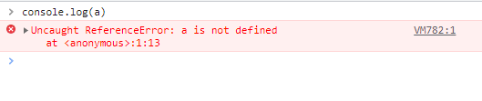
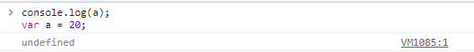
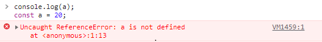
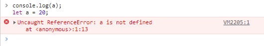
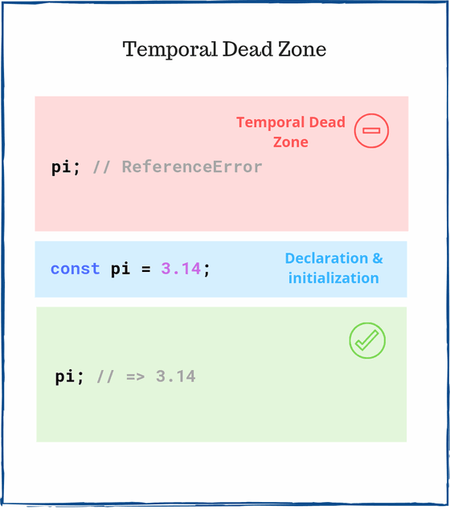

# 호이스팅(Hoisting)

## 호이스팅이란?
자바스크립트에서는 선언하지 않은 변수를 콘솔로 찍으면 이런 에러가 난다.

```js
console.log(a);
```


그럼 이렇게 해당 변수값을 아래에 선언해주면 콘솔에는 어떤 값이 올라올까?

```js
console.log(a);
var a = 20;
```


딱 봤을 때는 변수 a가 선언되기 전에 콘솔을 찍으니 변수 a를 못 찾을 것 같지만 결과를 보면 <code>undefined</code> 값이 나오는걸 볼 수 있다.

이렇게 되는 이유는 위 코드는 자바스크립트 엔진이 실행할 때 다음과 같이 변하기 때문입니다.

```js
var a;
console.log(a);
a = 20;
```

보는것처럼 자바스크립트에서 변수를 선언하면 모든 변수가 최상단에서 먼저 선언된 다음 아래에서 할당되는 것을 볼 수 있는데 이것을 호이스팅(hoisting)이라고 한다.

그럼 이건 어떨까?

<em>var 대신에 const 사용시</em>

```js
console.log(a);
const a = 20;
```


<em>var 대신에 let 사용시</em>

```js
console.log(a);
let a = 20;
```


둘다 에러가 나는걸 보면 <code>const</code>와 <code>let</code>을 사용한 변수들은 호이스팅이 **안되는 것처럼** 보인다.

안 되는 것처럼 보이는 것 뿐이지 호이스팅이 되고 있긴하다. 다만 <code>const</code>와 <code>let</code>은 <code>var</code>와는 다르게 **Temporal Dead Zone(TDZ)**의 영향을 받기 때문이다.

## TDZ(Temporal Dead Zone)?

<em style="display: block; text-align: center;">출처: <a href="https://dmitripavlutin.com/javascript-variables-and-temporal-dead-zone/">https://dmitripavlutin.com/javascript-variables-and-temporal-dead-zone/</a></em>

TDZ가 무엇인지 나타내는 좋은 이미지이다.
**Temporal Dead Zone**이라는 말 그대로 임시적으로 값을 찾지 못하는 곳인데, 호이스팅은 되었지만 TDZ에 영향을 받는 변수는 TDZ에 있을 때 그 값을 찾지 못하고 에러를 뿜어낸다.

## TDZ 영향을 받는 경우
<code>const</code>와 <code>let</code>과 <code>class</code>는 TDZ의 영향을 받는다.  

## TDZ 영향을 받지 않는 경우
<code>var</code>와 <code>function</code>과 <code>import</code>는 TDZ의 영향을 받지 않는다.

## 결론
요즘 최신 FE Framework를 보면 <code>var</code> 사용을 못하게 하는 경우가 많은데, <code>var</code>를 사용시 변수 선언 전에 사용할 수 있기 때문에 코드가 깔끔해지지 못하거나 변수 설정을 잘못하는 경우가 생길 수 있다.  

<code>const</code>나 <code>let</code>을 사용해 변수 선언 전에는 값을 찾지 못하도록 해서 변수 설정에 문제가 없도록 하자.